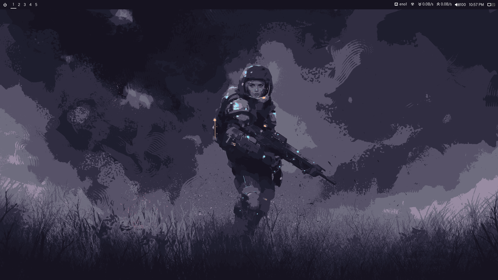
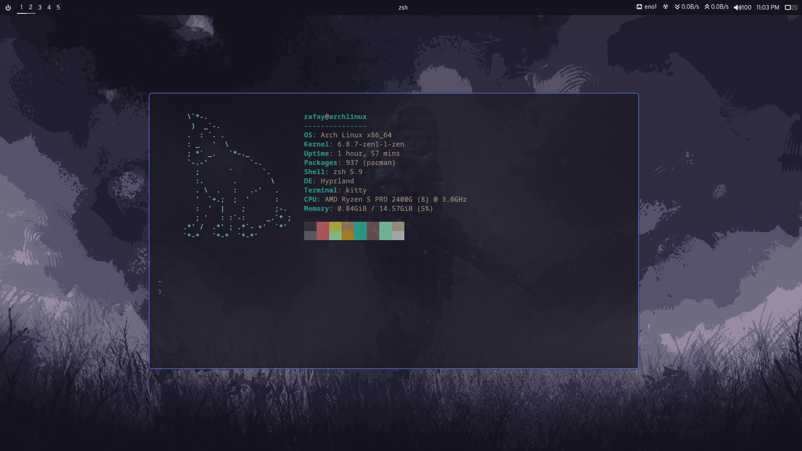

# Dotfiles for Hyprland

This repository contains my personal dotfiles for the Hyprland Compositor. These configurations are modified versions based on the fantastic work of [pineedaa](https://github.com/pineedaa). Huge thanks to pineedaa for providing the foundation for these dotfiles!

## Something to Say

I haven't used Hyprland in a while, and I’m not sure if I’ll come back to it anytime soon. Perhaps if I switch to a bigger monitor—my laptop screen just feels too small for a tiling manager. Who knows? Anyways, have fun with these dotfiles!

## Dependencies

Make sure you have the following dependencies installed: (Downlaod them from arch repos or aur)

- **Bar**: [waybar](https://github.com/Alexays/Waybar)
- **Terminal**: [kitty](https://sw.kovidgoyal.net/kitty/)
- **Wallpaper**: [hyprpaper](https://github.com/prateekmedia/hyprpaper)
- **Clipboard**: [cliphist](https://github.com/cdown/cliphist)
- **Idle**: [hyperidle](https://github.com/pineedaa/hyperidle)
- **Lockscreen**: [hyprlock](https://github.com/pineedaa/hyprlock)
- **Menu**: [rofi](https://github.com/davatorium/rofi)
- **Notifications**: [dunst](https://github.com/dunst-project/dunst)
- **Screenshot**: [grim](https://github.com/emersion/grim)
- **Screen Selection**: [slurp](https://github.com/emersion/slurp)
- **Network Manager**: [network-manager-applet](https://archlinux.org/packages/extra/x86_64/network-manager-applet/)
- **Polkit Agent**: [polkit-gnome-agent](https://archlinux.org/packages/extra/x86_64/polkit-gnome/)

## Fonts

To ensure proper rendering of icons and glyphs, download and install the following fonts:

- [Overpass Nerd Font](https://github.com/ryanoasis/nerd-fonts/releases/download/v3.2.1/Overpass.zip)

## Acknowledgments

- [pineedaa](https://github.com/pineedaa/dotfiles/tree/master) for the original dotfiles repository.
