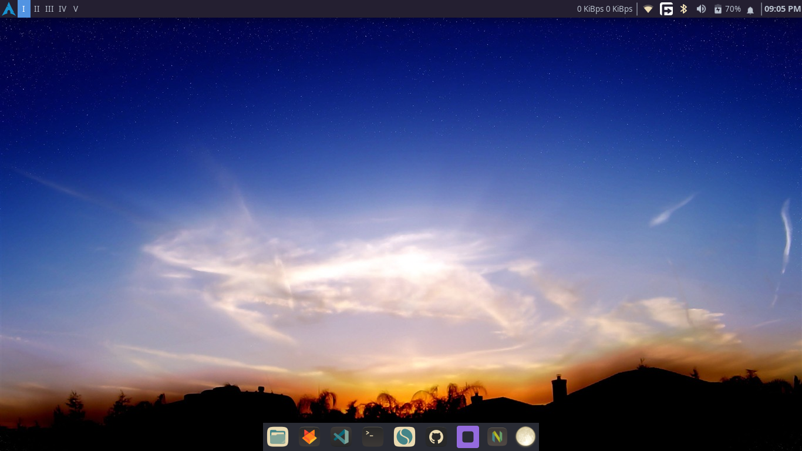
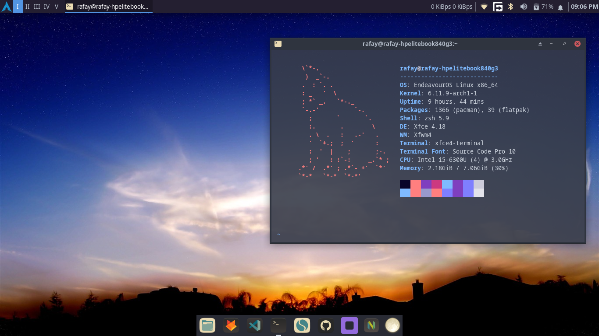

# Dotfiles for XFCE4

I recently switched from KDE to XFCE, and I haven't used Hyprland or any other tiling window manager since moving to a laptop due to the smaller screen real estate. XFCE strikes the perfect balance between a desktop environment and a tiling window manager. I was on KDE for about a year, and while it wasn't a terrible experience, I found it a bit more complex than I wanted. What I like about XFCE is how simple it is. It offers just enough customization without overwhelming you with too many options that make your brain feel like it's on overload 😭. For now, I'm sticking with XFCE, and I’m really enjoying it.




## Get XFCE4

1. **Install XFCE4** (for Arch Linux)
    ```bash
    sudo pacman -S xfce4 xfce4-goodies
    ```

2. **Install LightDM** (Optional, for graphical login)
    ```bash
    sudo pacman -S lightdm lightdm-gtk-greeter
    ```

3. **Enable LightDM** to start at boot:
    ```bash
    sudo systemctl enable lightdm.service
    ```
